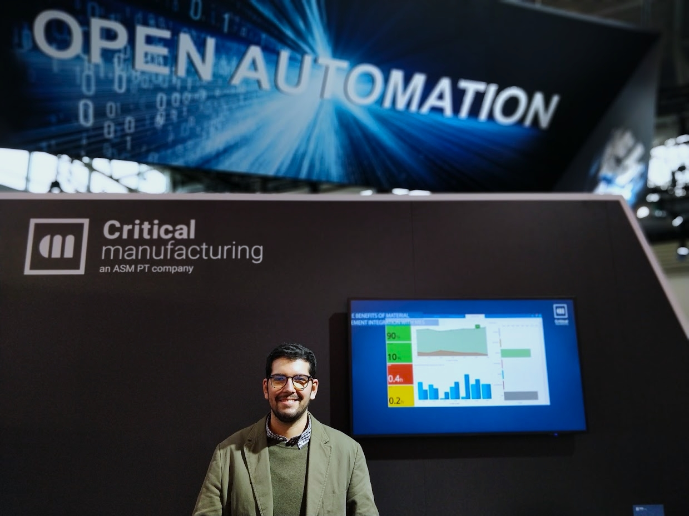

## Connecting the Future: Critical Manufacturing at Productronica 2021

Productronica 2021 in Munich marked a pivotal moment for the electronics manufacturing industry. As one of the world’s leading trade fairs for innovative electronics production, it gathered industry leaders, technology pioneers, and influential players under one roof. For Critical Manufacturing, a global provider of advanced Manufacturing Execution Systems (MES), this was more than just another industry event – it was a strategic opportunity to forge meaningful connections, especially with key hardware suppliers.

## Why Productronica Mattered for Critical Manufacturing
At Critical Manufacturing, we recognize that the backbone of Industry 4.0 lies in the seamless integration of hardware and software. Our MES solutions are designed to empower manufacturers with unparalleled control, visibility, and agility. To achieve this, collaboration with innovative hardware suppliers is crucial. Productronica 2021 provided the ideal platform to explore the latest advancements and strengthen partnerships that would drive the next generation of smart factories.

My goal for this trip was clear: reach out and create connections with leading hardware suppliers. I sought to understand their newest technologies, enhance compatibility with our MES platform, and discuss potential collaborations to enhance the digitalization journey for manufacturers worldwide.

## Strengthening Ties with ASM PT

A key highlight of our presence at Productronica was the opportunity to engage with ASM Pacific Technology (ASM PT) – a renowned name in the industry and a company closely related to Critical Manufacturing. ASM PT's cutting-edge equipment and solutions are pivotal in optimizing electronics production, aligning perfectly with our MES platform's capabilities.

This was a great opportunity to have not just our booth, but to also have booths showing our product with ASM. Also our collaboration in building a presentation. It was an honor having our product powering the demo for ASM. The demo consisted of a lights off factory that would automatically feed the pick and place machines with trays and feeders with the use of AGVs.

By reinforcing our relationship with ASM PT, we are not only enhancing integration possibilities but also ensuring that our mutual customers benefit from seamless connectivity and advanced automation solutions. This synergy supports manufacturers in achieving higher efficiency, quality, and flexibility, which are essential for staying competitive in today's dynamic market.

## Insights and Inspiration

Attending Productronica 2021 also provided valuable insights into the latest trends driving the electronics manufacturing industry. From AI-driven analytics and predictive maintenance to the rising importance of cybersecurity in connected environments, the event underscored the need for adaptable and scalable MES solutions.

These trends are already influencing our roadmap at Critical Manufacturing. We are committed to developing solutions that not only meet current industry demands but also anticipate future needs. This approach ensures that our customers can leverage the full potential of digital transformation, regardless of how rapidly technology evolves.

## Looking Ahead: The Future of MES and Hardware Integration

Productronica 2021 was more than just an event; it was a catalyst for innovation and collaboration. Our mission to reach out and create connections with hardware suppliers was accomplished with resounding success. By fostering these relationships, we are strengthening our position as a leader in MES solutions while empowering manufacturers to build smarter, more agile factories.

As we look to the future, Critical Manufacturing remains dedicated to pushing the boundaries of what MES can achieve. With strategic partnerships and cutting-edge integrations, we are paving the way for a new era of connected manufacturing.

Stay tuned as we continue to transform manufacturing through innovation, collaboration, and excellence.

## About Critical Manufacturing

Critical Manufacturing is a leading provider of Manufacturing Execution Systems (MES) designed to help manufacturers transition to Industry 4.0. With a focus on flexibility, scalability, and advanced integration capabilities, our MES solutions empower electronics manufacturers to achieve optimal efficiency, quality, and agility.

For more insights and updates, follow us on our digital channels [linkedin]("https://www.linkedin.com/company/critical-manufacturing/posts/?feedView=all") [instagram]("https://www.instagram.com/criticalmanufacturing/?hl=en") or visit our [website]("https://www.criticalmanufacturing.com/").

## Final Thoughts
Productronica 2021 demonstrated the power of connection and collaboration. As we continue to build bridges with hardware innovators and strategic partners like ASM PT, Critical Manufacturing is excited to lead the charge in transforming the future of electronics manufacturing.

Here’s to the next generation of smart factories – powered by Critical Manufacturing MES.

Critical Manufacturing Stand