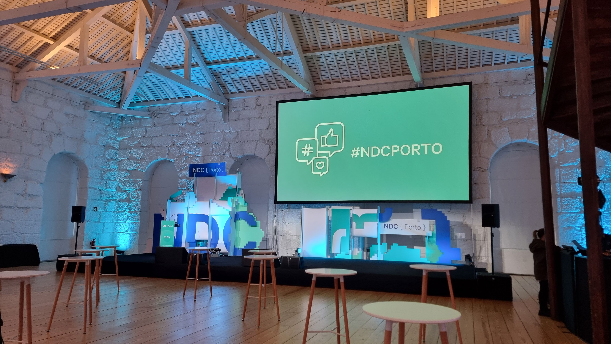
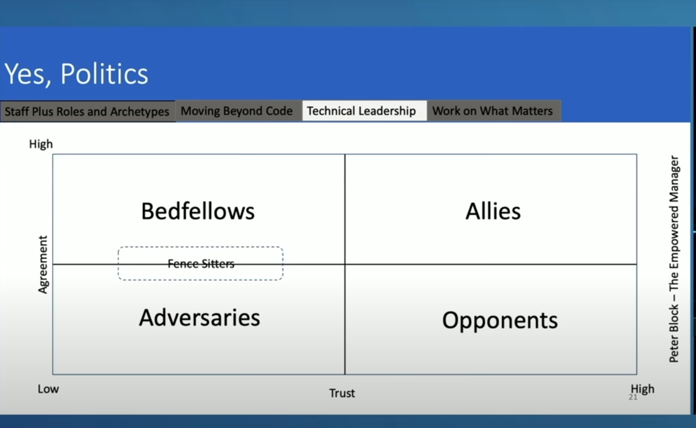

## What happened at NDC Porto 2024

Wow, what an amazing opportunity and how lucky is Porto for having such an awesome event as NDC. Unfortunately, I could only attend one day, so I had to choose very wisely.

I was super excited to attend, as it always seemed interesting and engaging. Normally, the ticket is too expensive for me to be able to justify it, but shout-out to [Critical Manufacturing ](https://www.criticalmanufacturing.com/) as I was able to annoy them so much they gave me a ticket 🤘 Never underestimate the power of annoying in a respectful and exciting way.

---

## Memorable Talks - Kent Beck - Tidy First? A Daily Exercise in Empirical Design

Right away it started with a center stage talk by [Kent Beck](https://www.linkedin.com/in/kentbeck/). Who is at this point an all around all star programmer. His views on how to program have shaped how software is built all around the world.

He gave an eye opener talk, explaining the context of software and focusing on how software is an engineering tool and in order to create great engineering we live in constant flux of managing expectation and goals.

Feel free to take a listen at -> [Keynote: Tidy First? A Daily Exercise in Empirical Design - Kent Beck - NDC Porto 2024](https://youtu.be/A9vRp9T8pkU?si=XGohDn2uV00vyXeC), the talk is also based on [Tidy First?: A Personal Exercise in Empirical Software Design](https://www.goodreads.com/book/show/171691901-tidy-first).

---

## Memorable Talks - Filip Ekberg - What's new in .NET 9 & C# 13

Well, it's a well known trope that Microsoft is the evil leviathan. They do give us aberrations like the copilot keyboard key or produce software that starts out worse than alphas from a startup (looking 👀 at you MSTeams). But one thing is certain, Microsoft normally sticks with it. The years pass and the .NET ecosystem just looks stronger and stronger, yes they have some weird things that they are always promoting, cloud this aspire to that. But when you look at the fundamentals, they look pretty great.

I loved the talk by Filip Ekberg and we can see how Microsoft keeps pushing the ball forward in so many ways.

Feel free to take a listen at -> [What's new in .NET 9 & C# 13 - Filip Ekberg - NDC Porto 2024](https://youtu.be/8XZr3KVjNJw?si=LPsbdr8W_xqbTwGE).

---

## Memorable Talks - Ian Cooper - Being Staff Plus

This was one of the one's I was more excited about. I am kind of something like a Staff Plus engineer (yeah this kind of fuzzy language is normal for these kinds of roles) and I was yearning to understand how people out there deal with this.

It did not disappoint I also loved so many references to interesting books like [Staff Engineer: Leadership Beyond the Management Track](https://www.goodreads.com/book/show/56481725-staff-engineer), [The Staff Engineer's Path: A Guide for Individual Contributors Navigating Growth and Change](https://www.goodreads.com/book/show/61058107-the-staff-engineer-s-path) which I've since started reading and have been so interesting.

I have to say I love how operational it was and how it traveled through the facets of this very strange and hard to define thing, the staff engineer.

I also loved this matrix, really food for thought.

---

