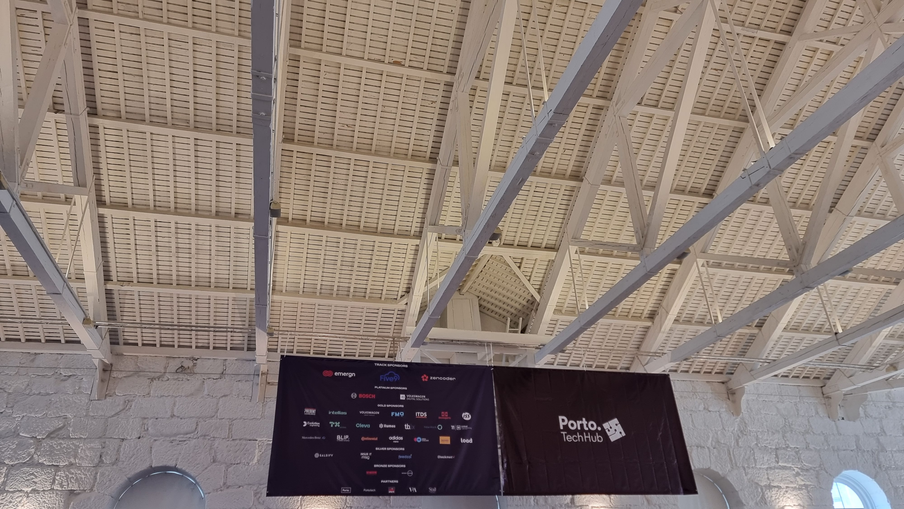
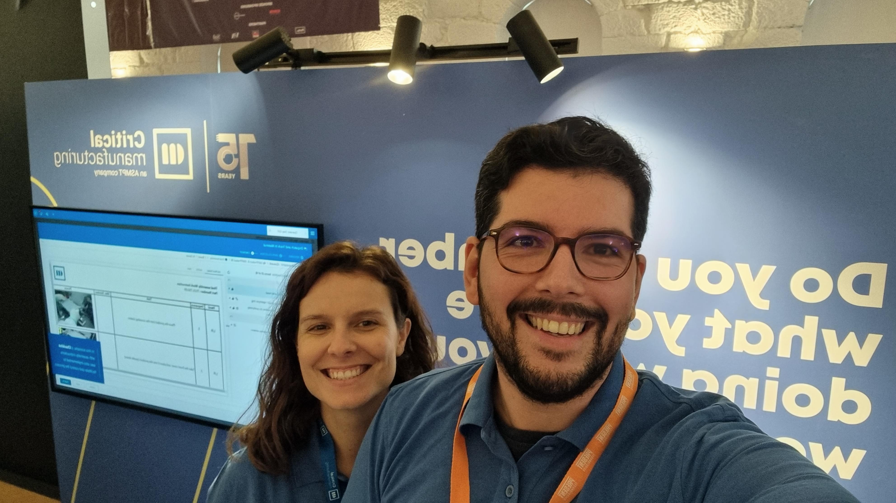

## Reflecting on Porto Tech Hub 2024: A Different Experience  

This year, I had the opportunity to represent **Critical Manufacturing** at **Porto Tech Hub 2024**, stationed at our booth, ready to engage with the tech community. Having the opportunity to carry the flag for my company. Going in, I was excited, remembering the vibrant atmosphere and inspiring talks from previous editions. However, this year’s experience turned out to be a bit different.  

---

## At the Critical Manufacturing Booth  

Being at the **Critical Manufacturing** booth was a great opportunity to showcase our cutting-edge MES solutions and connect with attendees curious about our give aways 😛. It was great to have the experience of communicating our product to people that had no idea what we did and had never heard of an MES.

That said, the overall engagement felt a bit... lukewarm. While we had a steady stream of visitors, the crowd was mostly a mix of junior developers and tech enthusiasts. There was a noticeable lack of **senior software engineers** — the kind of conversations that lead to deeper technical discussions and potential collaborations were few and far between.  

It made me realize how crucial the audience demographic is for making the most out of networking events.  

---

## Talks That Didn’t Quite Hit the Mark  

I always look forward to the talks at **Porto Tech Hub**, as they usually provide fresh insights and inspire new ideas. Unfortunately, this year, the sessions didn’t resonate as strongly. The topics felt a bit recycled, and the depth of the content wasn’t as engaging as in previous years.  

Don’t get me wrong—  there were still valuable lessons to take away. But compared to past editions, where I left with a notebook full of ideas, this year was noticeably less impactful.  

---

## A Learning Experience Nonetheless  

Despite the lukewarm atmosphere, attending **Porto Tech Hub 2024** wasn’t without its positives. It was a great opportunity to strengthen **Critical Manufacturing’s** brand presence and introduce our solutions to a broader audience.  

It also served as a reminder that not every event will be groundbreaking, and that’s okay. Each experience contributes to growth, even if it’s by highlighting areas for improvement.  

---

## Looking Ahead  

While **Porto Tech Hub 2024** didn’t quite live up to my expectations, I’m still grateful for the experience. It’s events like these that provide perspective and help us refine our approach for the future. It was also a challenge to have these types of face to face and social gatherings, but we live and we learn.

I’m hopeful that next year’s edition will bring back the spark and energy that makes **Porto Tech Hub** such a valuable event for the tech community. Until then, I’ll keep sharing, learning, and growing.  

**Here’s to better connections and more inspiring conversations next time!**  

<figure>
    
    <figcaption class="center">Porto TechHub</figcaption>
</figure>
