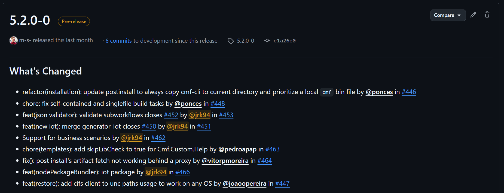
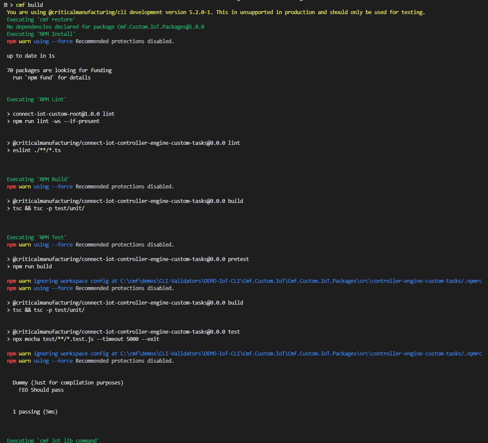

For this post I want to discuss how Connect IoT was changed by version **v5.2.0** of the [CM CLI](https://github.com/criticalmanufacturing/cli/).



---

## Brief History - for the Old People like me

*In the Beginning, there was one generator* (Connect IoT project scaffolding).

Actually they were kind of done in parallel, so in the Beginning there was one [generator](https://www.npmjs.com/package/@criticalmanufacturing/generator-iot) and one [framework](https://github.com/criticalmanufacturing/cli/). 

*And there was harmony throughout the land...*

In fact, we were always a bit discontent with this solution. What was happening was that the CLI generated a customization project for Connect IoT, but all the components of Connect IoT were then managed with the [generator-iot](https://www.npmjs.com/package/@criticalmanufacturing/generator-iot). This was a bit unintuitive for the user because he had to jump across tooling. Nevertheless, there were little changes from v6 of the MES to v9, regarding scaffolding of IoT. So everyone was kind of used to this solution. 

Even though the CLI itself was always able to scaffold without the need of any other tool.

### The first chink

The [generator-iot](https://www.npmjs.com/package/@criticalmanufacturing/generator-iot) was fully based on [yeoman](https://yeoman.io/) and yeoman I think from 4.5 (don't quote me on this), introduced changes that kind of made it that we had to do a revamp of the tool.

*But, alas we procrastinated.*

### The second chink

With the move to Angular 15 we no longer could just side load our components and had to conform to being a bizarre hybrid between an angular workspace and a nodejs one. 

A new scaffolding tool was born [ngx-schematics](https://github.com/criticalmanufacturing/ngx-schematics/tree/d43250751cdf98bbaa0dd61c81dc9048b0562033/packages/ngx-iot-schematics).

### Final straw

We moved to linux and we kept finding that [yeoman](https://yeoman.io/) was always giving us annoying issues with permissions for directories. Yes, it can be that we are noobs, but we tried fixing it and it was flaky at best.

*Alas procrastination was no more.*

 With the creation and release of `Automation Task Libraries` (an angular free way to define Connect IoT Tasks) we no longer needed the new scaffolding tool and honestly we were a bit fed up with managing three tools so we took the effort to finally migrate everything to the CLI.


**Info:** Using angular is still supported, just not incentivized 😉.


---

## Unified Generator

All components of `Connect IoT` are customizable. 

If you want a new task, converter or even a new driver. There's no difference between what would be called *customization* and how CM develops internally. Throughout the years this has been awesome and has allowed for a great deal of cross-pollination between what are projects and what is then turned into the core product and vice-versa.

## Creating a new IoT Package in 5.2.0

Let's do an example, I want to create an IoT package with one task and one converter. Should be pretty simple.

First, I will create my iot customization package:

```bash
cmf new iot
```


This commands creates my iot workspace, it has a package for master data and a package for iot customization.


**Info:** Connect IoT scaffolding generates a parent root package. Packages that are of type root are installable packages, this means each iot package is an installable package. This can be very helpful if you wish to segment your integrations and if you want to reuse some of them, in other contexts.


---

For the master data part, nothing has changed, so I will delete that. In order to delete dependencies I can simply go to the `cmfpackage.json` of my root package and remove that dependency:

Scaffolded `cmfpackage.json`:

```json
{
  "packageId": "Cmf.Custom.IoT",
  "version": "1.0.0",
  "description": "Cmf Custom cmf Cmf.Custom.IoT Package",
  "packageType": "Root",
  "isInstallable": true,
  "isUniqueInstall": false,
  "dependencies": [
    {
      "id": "Cmf.Environment",
      "version": "11.1.0",
      "mandatory": false
    },
    {
      "id": "Cmf.Custom.IoT.Packages",
      "version": "1.0.0"
    },
    {
      "id": "Cmf.Custom.IoT.Data",
      "version": "1.0.0"
    }
  ]
}
```

Removing what I don't need:

```json
{
  "packageId": "Cmf.Custom.IoT",
  "version": "1.0.0",
  "description": "Cmf Custom cmf Cmf.Custom.IoT Package",
  "packageType": "Root",
  "isInstallable": true,
  "isUniqueInstall": false,
  "dependencies": [
    {
      "id": "Cmf.Environment",
      "version": "11.1.0",
      "mandatory": false
    },
    {
      "id": "Cmf.Custom.IoT.Packages",
      "version": "1.0.0"
    }
  ]
}
```

---

### Creating a new IoT Task Library

A IoT customization package can hold several `Connect IoT Package` (npm packages). For this example, I will use only one, but there's no limitation on this. It's is common to have multiple packages, some with tasks, others with drivers, etc. The packages should hold things that make sense together and should not be generic agglomerations.

In the IoT Package run:

```bash
cmf new iot taskLibrary
```


Remember that tasks and converters are grouped inside a **task library**.

### Creating a new IoT Task

Inside my task library, I can now generate components. Let's start with a task.

```bash
cmf new iot task
```


### Creating a new IoT Converter

Inside my task library. Let's create a converter.

```bash
cmf new iot converter
```


So we now have a task library, with a basic task and converter.

---

## Deploying to a Development System

For development, we can be a bit more lax. Let's see how we can use what we have generated to deploy it to a development MES system.


**Disclaimer:** Every Connect IoT package should be installed by generating a new artifact from the `cmf pack` of the iot package and by performing an MES installation of that package. This mechanism is the only way to ensure that what is deployed is according to what was committed and tested and to guarantee that there are no package version collisions.


### Building

Like any other CM CLI customization package, in order to prepare the package, just run:

```bash
cmf build
```



---

Notice that there's a lot of thing happening from an `npm install` to a linter to `npm build` and `npm test`. This lifecycle can be manually run when you are developing. All of these commands are present in a set of `package.json` scripts:

```json
"scripts": {
  "build": "tsc && tsc -p test/unit/",
  "build:test:cover": "npm run build && npm run test:cover",
  "lint": "eslint ./**/*.ts",
  "lint:fix": "eslint ./**/*.ts --fix",
  "watchPackage": "tsc --preserveWatchOutput -w",
  "watchTests": "tsc -p test/unit --preserveWatchOutput -w",
  "test": "npx mocha test/**/*.test.js --timeout 5000 --exit",
  "test:cover": "npx nyc -r cobertura -r lcov -r text-summary mocha test/*.test.js test/**/*.test.js -- --timeout 10000 --exit -R mocha-multi-reporters --reporter-options configFile=mocha-multi-reporters-config.json",
  "pretest": "npm run build",
  "watch": "npm run build -- -w | npx mocha --timeout 10000 --exit --reporter min -w test/*.test.js test/**/*.test.js",
  "generateTask": "cmf new iot task",
  "generateConverter": "cmf new iot converter",
  "packagePacker": "packageBundler -d -o=."
}

```

Looking at the scripts, there are **six** subsets of commands:

- **build** commands
  - build - builds the source code
  - build:test:cover - builds the source code and runs tests with  coverage
- **lint** commands
  - lint - runs a linter validation in the code
  - lint:fix - runs a linter validation and fixes what can be fixed
- **test** commands
  - test - run tests
  - test:cover - run tests with coverage
- **watcher** commands
  - watchPackage - a watcher on the source code that is always compiling the source code
  - watchTests -  a watcher on the source code and tests that is always compiling the source code
- **generator** commands
  - generatorTasks - generates a new task
  - generateConverter - generates a new converter
- **bundler**
  - packagePacker - creates a connect iot package

---

### Packing 

We have already a task and converter built. So let's generate a package. We can run `cmf pack` in the root and this will generate an iot customization package that is installable by the MES. For development purposes this is a bit cumbersome. We can also just run the command to bundle the library `npm run packagePacker`.


**Info:** Our bundling tool is can be found at [node-packagebundler](https://github.com/criticalmanufacturing/node-packagebundler).


Running this command will generate a `tgz` file.

### Deploying to the MES

The MES has a section focused on `Connect IoT` deployments. The `Automation Repository` page. In this page we can see all the packages that have deployed and we can add more. This is very helpful when you are continuously creating new versions or overriding existing versions.


Now the system knows the package. This package has tasks and converters, so let's add the `Automation Task Libraries` so we can see those components in the ui.


### Adding to our Workflow

The customization package is now ready to use. We can create an `Automation Controller` and use our tasks.


Notice that right away we see our package `My Tasks` and we can select and it to our controller. Packages can be scoped and only appear for a particular type of Controller.

--- 

## Recap

Version **5.2.0** brings a whole new way of creating customization for `Connect IoT`. This was a very simple of example of how with a simple set of commands you can generate all you need to start happy coding 🧑‍💻. Now in an even more intuitive and integrated way.


**Info:** You can find the project used for this demo at [CLI-IoT520](https://github.com/jrk94/cm-demo-repos/tree/main/CLI-IoT520)


Thank you for reading !!!
