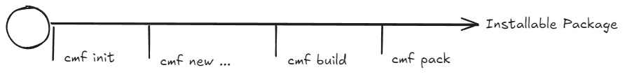
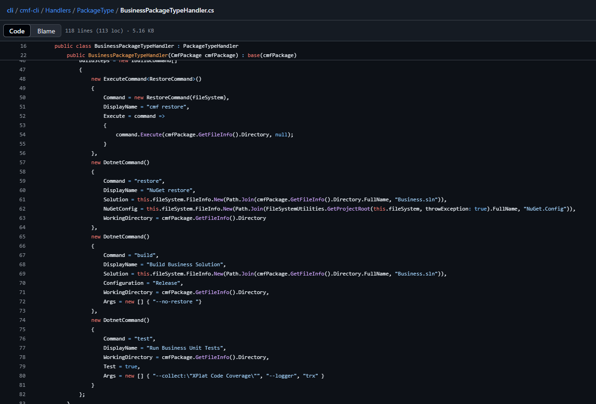
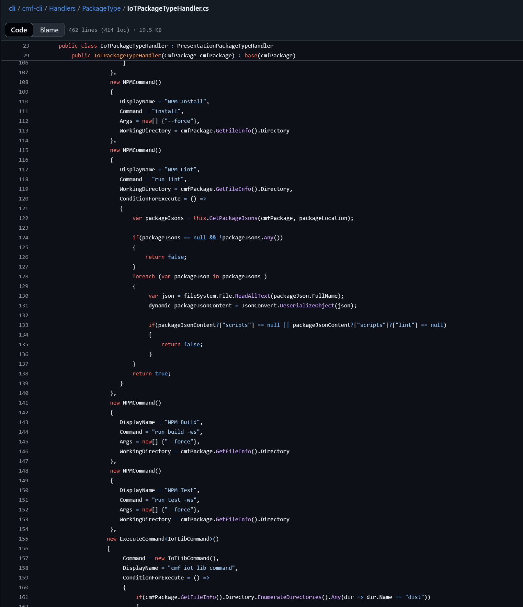
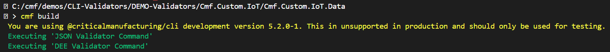
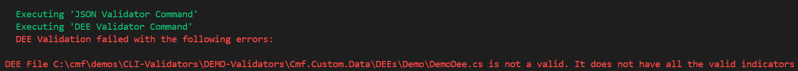
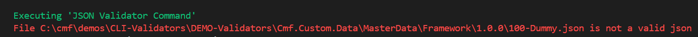
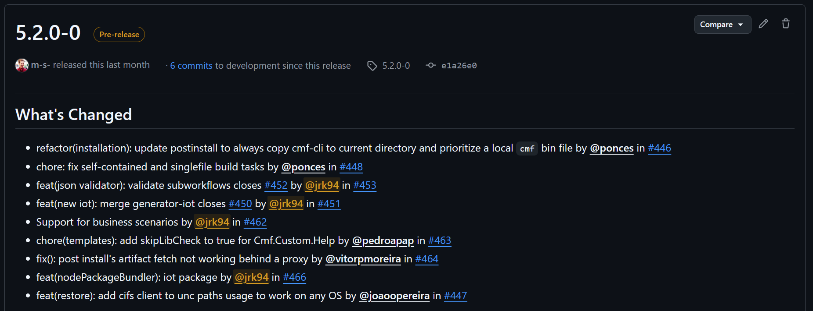
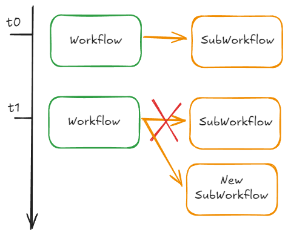
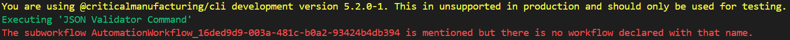

For this post I want to discuss what for me is one of the least understood features of [CM CLI](https://github.com/criticalmanufacturing/cli/), the build validators.

## CLI Command Lifecycle

First, let's talk a bit about the main commands of the CLI for building customization. There are four of them:

- `cmf init` - Setups the customization project
- `cmf new ...` - Creates new customization packages
- `cmf build` - Used to *compile* the customization package
- `cmf pack` - Transforms the customization package into an installable customization artifact

This is a brief summary of them, there is a lot specificity that depends on the type of package that you are generating. Organizing this in a straight timeline:




**Info:** Nothing stops you from adding new customization packages at any time in the process. The diagram is just to illustrate an MVP path.


---

## CLI Command - Build

This is the one that I want to focus on for today. There's a problem with the name of the command - `build`. 

People think this means to compile code. For some packages this is mostly correct, but actually here build means something more holistic. It means to prepare everything that package needs to create a customization artifact and it can also mean to check that the package is `ok`.

If we think about a package like `Business`, it is true that the main action the `cmf build` will do is the `dotnet restore` and `dotnet build` to make sure the solution is compiled. But already, we can see that it can do other build steps, for example it can run unit tests.



This is important because it means we can continuously improve the build process to **pick common errors or bad practices**. For example, if we look at another interesting package the `IoTPackage`, this package is not only using the build to perform an `npm run build`, but we also see that it is performing as linting validation and also running unit tests.



So, we can easily tweak and define the build steps with logic that we find relevant in order to make the package ready to be packed. 

For packages that are focused in customization code, the pattern is more or less simple, linting rules, unit tests and compile. But this is where the fun begins...

---

## CLI Command - Build for Functional Packages

Everyone is always looking at the packages with code and they forget that the `Data` packages are also packages that run the `cmf build` and can therefore have logic on the build command. 

In version `5.2.0` of CM CLI we introduced a new validator, so let's use that as a pretense to look at all of them.

### DEE Validator

**Dynamic Execution Engine** are a set of C# code that can be directly invoked or appended to MES actions. This is one of the most useful ways to perform small customizations in the MES. A DEE is nothing more than two snippets of C# code.

- **Condition**/Validation - Snippet of Code that assesses if the DEE should execute or not
- **Action**/Execution - Code that the DEE will execute

The DEEs are deployed like any part of the master dataand can be edited directly in the system, they are part of the `Data` package. Nevertheless, to have unit tests and to be part of an integrated solution they have a weak link to the `Business` package, where we can have a solution with all elements.

How does the system know where the DEE starts and finishes? Simple, it is expecting some hooks:

```csharp
using System.Collections.Generic;

namespace Cmf.Custom.Demo.Actions.Demo
{
    internal class DemoDee : DeeDevBase
    {
        public override Dictionary<string, object> DeeActionCode(Dictionary<string, object> Input)
        {
            //---Start DEE Code--- 

            //---End DEE Code---

            return Input;
        }

        public override bool DeeTestCondition(Dictionary<string, object> Input)
        {
            //---Start DEE Condition Code---

            #region Info

            /* Description:
             *  
             * Action Groups:
             *    N/A
             *     
            */

            #endregion

            return true;

            //---End DEE Condition Code---
        }
    }
}
```

What happens if for some reason any of the hooks is wrong? Well... It will throw a very red exception when you are deploying this to your system. But what if we can preempt this and validate the hooks beforehand. 

This is where the **DEE Validator** comes along. If you ever run a `cmf build` on a `Data` package you will see an interesting message:



It is stating that the `DEE Validator Command` was executed. Let's run the same command but with this code:

```csharp
using System.Collections.Generic;

namespace Cmf.Custom.Demo.Actions.Demo
{
    internal class DemoDee : DeeDevBase
    {
        public override Dictionary<string, object> DeeActionCode(Dictionary<string, object> Input)
        {
            // RaNdoM TypO---Start DEE Code---

            //---End DEE Code---
(...)
```


Notice that the build command reacts to it and warns you that it has found a DEE with invalid tokens. The system preemptively stops you from committing what would be `bad code`.

### JSON Validator

Going back to this image:


It also mentions that a `JSON Validator Command` was executed. What this means is that the build command is scraping all the json master data files and validating that they are valid JSON files. This is a pretty common issue, if a merge of master data is incorrectly done, it is very easy to end up with invalid JSON files.

If for example we have a json master datalike:

```json
{
    "<DM>Reason": {
        "1": {
            "Name": "AlarmDetected",
            "Description": "",
            "ReasonType": "Hold",
            "SecurityRole": "",
            "DocumentationURL": "",
            "IsTemplate": "No",
            "ExcludeFromStepYield": "No",
            "ExcludeFromResourceYield": "No",
            "Category": "",
            "EnableConcurrentInstances": "No"
        }
    }
}
```

And change it a bit to be broken in a way that is hard to spot, i.e:

```json
{
    "<DM>Reason": {
            "Name": "AlarmDetected",
            "Description": "",
            "ReasonType": "Hold",
            "SecurityRole": "",
            "DocumentationURL": "",
            "IsTemplate": "No",
            "ExcludeFromStepYield": "No",
            "ExcludeFromResourceYield": "No",
            "Category": "",
            "EnableConcurrentInstances": "No"
        }
    }
}
```

Running `cmf build` we have:



### JSON Validator SubWorkflows

So, let's get back to the start, [v5.2.0](https://github.com/criticalmanufacturing/cli/releases/tag/5.2.0-0) let's take a look at the release notes, do we spot something related with validators?



Indeed we do: `feat(json validator): validate subworkflows`.

This was a plot twist we added to the JSON Validator Command, which came from people building Connect IoT integrations.


**Problem Statement:** We have workflows that depend on subWorkflows, but sometimes throughout time people change workflows and we end up with workflows that are pointing to subWorkflows that no longer exist or have changed name.




They want to make sure that if at *t1* the reference changes and the subWorkflow of *t0* no longer exists, the validator gives an error.

Let's see an example, here we have a workflow that has a setup page and then a main workflow and a subWorkflow.

```json
  "AutomationControllerWorkflow": {
    "1": {
      "AutomationController": "Secs-Gem Controller [A.1]",
      "Name": "AutomationWorkflow_fb2e041f-323c-4935-a320-3ced69af37b7",
      "DisplayName": "Setup",
      "IsFile": "Yes",
      "Workflow": "Dummy/Setup.json",
      "Order": "1",
      "IsTemplate": "No",
      "IsShared": "No",
      "Indentation": "0",
      "WorkflowType": "DataFlow"
    },
    "2": {
      "AutomationController": "Secs-Gem Controller [A.1]",
      "Name": "AutomationWorkflow_fb2e041f-323c-4935-a320-3ced69af37b7",
      "DisplayName": "Setup",
      "IsFile": "Yes",
      "Workflow": "Dummy/Workflow.json",
      "Order": "2",
      "IsTemplate": "No",
      "IsShared": "No",
      "Indentation": "0",
      "WorkflowType": "DataFlow"
    },
    "3": {
      "AutomationController": "Secs-Gem Controller [A.1]",
      "Name": "AutomationWorkflow_16ded9d9-003a-481c-b0a2-93424b4db394",
      "DisplayName": "Setup",
      "IsFile": "Yes",
      "Workflow": "Dummy/Subworkflow.json",
      "Order": "3",
      "IsTemplate": "No",
      "IsShared": "No",
      "Indentation": "0",
      "WorkflowType": "DataFlow"
    }
  }
```

If we take a look at the workflow of the `Workflow.json`: 

```json
"tasks": [
    {
        "id": "task_727",
        "reference": {
            "name": "workflow",
            "package": {
                "name": "@criticalmanufacturing/connect-iot-controller-engine-core-tasks",
                "version": "11.2.0-dev"
            }
        },
        "settings": {
            "inputs": [],
            "outputs": [],
            "automationWorkflow": {
                "DisplayName": "SubWorkflow",
                "IsShared": false,
                "Name": "AutomationWorkflow_16ded9d9-003a-481c-b0a2-93424b4db394"
            },
            "retries": 30,
            "contextsExpirationInMilliseconds": 60000,
            "executionExpirationInMilliseconds": 1200000,
            "executeWhenAllInputsDefined": false,
            "___cmf___name": "Call SubWorkflow"
        }
    },
(...)
```

We see that it has a reference to a subWorkflow. So, what happens if we change our master datato look like this:

```json
  "AutomationControllerWorkflow": {
(...)
    "2": {
      "AutomationController": "Secs-Gem Controller [A.1]",
      "Name": "AutomationWorkflow_fb2e041f-323c-4935-a320-3ced69af37b7",
      "DisplayName": "Setup",
      "IsFile": "Yes",
      "Workflow": "Dummy/Workflow.json",
      "Order": "2",
      "IsTemplate": "No",
      "IsShared": "No",
      "Indentation": "0",
      "WorkflowType": "DataFlow"
    },
    "3": {
      "AutomationController": "Secs-Gem Controller [A.1]",
      "Name": "MUCHBETTER_SUPPERNEW_AutomationWorkflow_16ded9d9-003a-481c-b0a2-93424b4db394",
      "DisplayName": "Setup",
      "IsFile": "Yes",
      "Workflow": "Dummy/MUCHBETTER_SUPPERNEW_Subworkflow.json",
      "Order": "3",
      "IsTemplate": "No",
      "IsShared": "No",
      "Indentation": "0",
      "WorkflowType": "DataFlow"
    }
  }
```



So we get an exception stating that you have a mismatch.

---

## CLI Command - Why should you care?

Why should the user care, if all of this is happening behind the scenes? Mostly you shouldn't care. But the user is very important in stating what he needs and how we can improve the tool to help safeguard mistakes. As teams grow, as projects become more long lived I think expanding what are the preemptive safeguards is crucial to prevent wasting time and improve the quality of the code that we deliver.

Please contribute with your ideas of things you would like to -> [Issues](https://github.com/criticalmanufacturing/cli/issues)

And hopefully you enjoyed learning a bit about we can do with our tooling


**Info:** You can find the project used for this demo at [CLI-Validators](https://github.com/jrk94/cm-demo-repos/tree/main/CLI-Validators)


Thank you for reading !!!