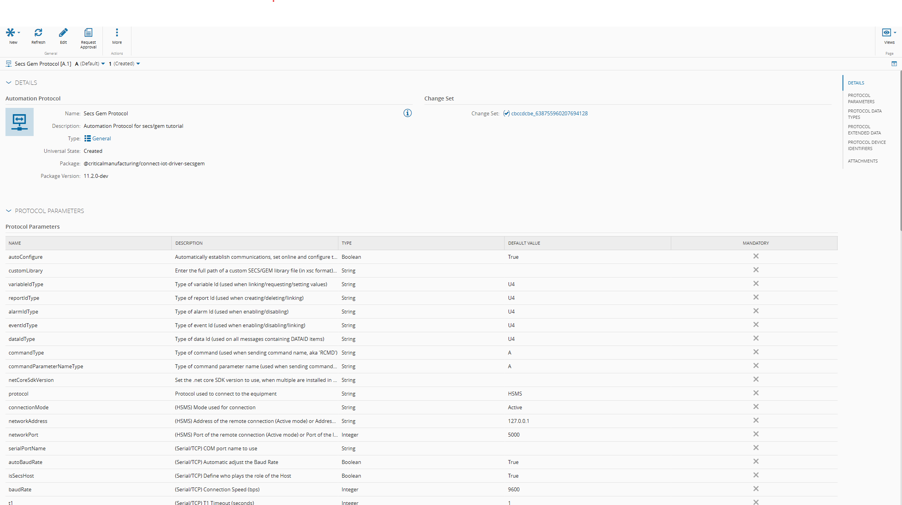
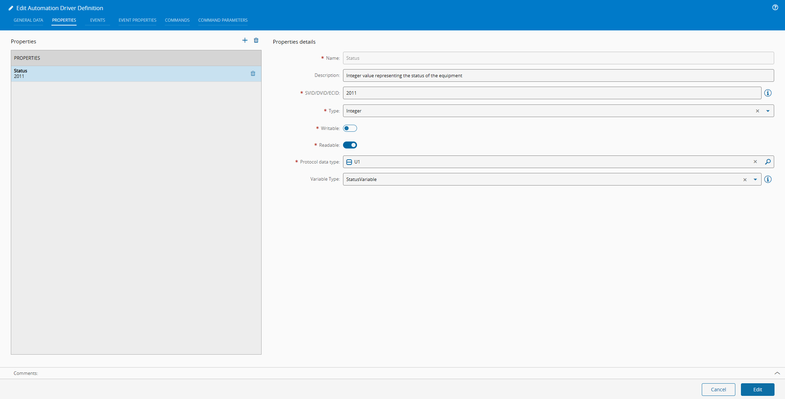
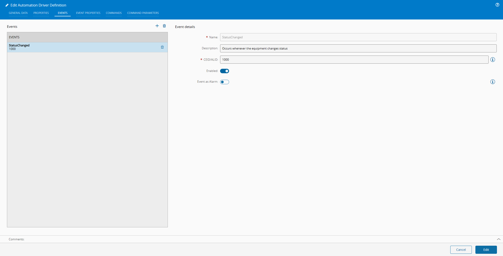
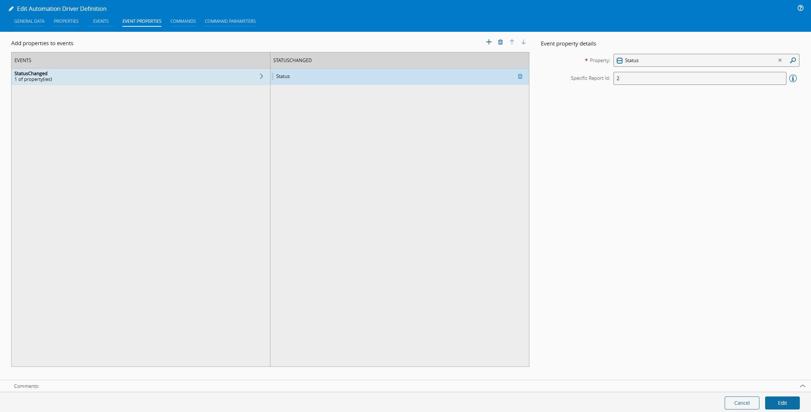
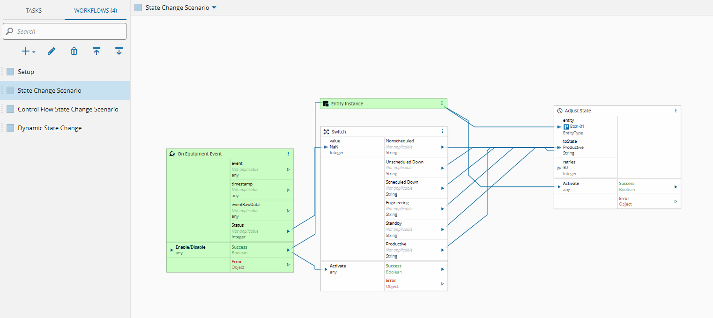
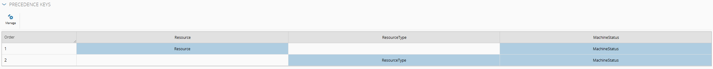
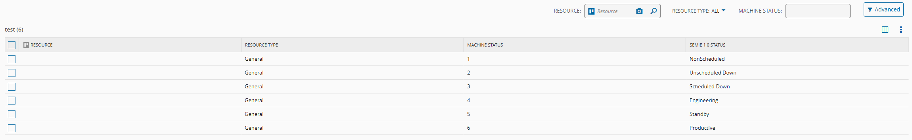
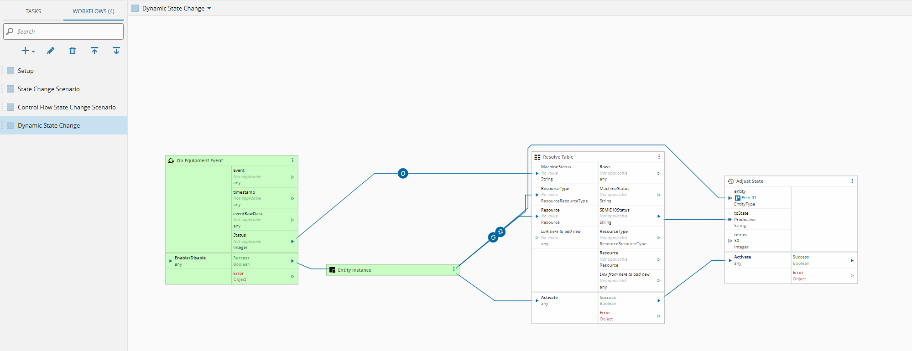

This post is about a twist on a popular tutorial.

# Tutorial SecsGem

One of the most common protocols for the semi-conductor area is Secs-Gem. Secs-Gem is a very robust and reliable protocol with a standardized format.

One simple example that showcases how `Connect IoT` handles secs-gem is a change of state model of a machine (i.e `MES Resource`). 

It's common that a machine has a state model different from the standard SEMI E-10. Sometimes the machine offers more states or most often than not, the machine is only able to partially achieve the SEMI E-10. The MES is able to work with the machine integration to offer a fuller view of what is happening in the machine.

This tutorial is an example where we have a secs-gem machine that as a mapping of integers from 1-6 to SEMI E10 States. The integration must connect to the machine, listen to an event and correctly change the states of the machine. CM's tutorial on this is very extensive, I will give a quick recap.

---

## Create an Automation Protocol

An `Automation Protocol` is responsible for creating the base configuration for a transport protocol. All driver definitions inherit their settings from the automation protocol. Most of the settings can also be changed in the controller, via the equipment configuration task.


**Info:** The technical specification of the vendor is very important in understanding how to setup each particular protocol setting.


---

## Create an Automation Driver Definition

The `Automation Driver Definition` will be where we map the relevant fields of the specification. Here is where we will configure all the events that we want to listen or commands that we want to execute.

The tutorial has a very simple example of of collecting the change of status, so let's imagine a very simple specification:

| VID  | VID Type | Format | Name           | Description                                           |
| ---- | -------- | ------ | -------------- | ----------------------------------------------------- |
| 2011 | SV       | U1     | Process status | Indicates the current process status of the equipment |

Table: VID Property

| CEID | Description/Trigger                              | RPTID |
| ---- | ------------------------------------------------ | ----- |
| 1000 | Occurs when the equipment process status changes | 2     |

Table: CEID Property

| Equipment Status | MES Resource SEMI E10 State |
| ---------------: | --------------------------- |
|                1 | Nonscheduled                |
|                2 | Unscheduled Down            |
|                3 | Scheduled Down              |
|                4 | Engineering                 |
|                5 | Standby                     |
|                6 | Productive                  |

Table: Mapping SEMI E10 Resource State to a property

In our example, we have to create a property:

An event:

And the link between properties and events, for secs-gem this is very important as properties are grouped in reports and reports are associated to events:

---

## Create an Automation Controller

The tutorial presents the following solution to this problem:

The solution is a workflow that will receive the event `Status Changed` with a single property `Status`, it will collect the entity instance linked to this integration (for example `Etch 01`) and will convert the machine value to SEMI E10 status with a switch and called the `Adjust State` task which will change the status of the Resource in the MES.

This solution is quite valid, but it lack some dynamism. It is very tailored to narrow use case.

Let's try and find out a better solution for this.

---

## Dynamic State Control

As we saw the integration was fully defined in the workflow. One way we can achieve a more flexible approach is with the use of a smart table.

A smart table allows us to have a context based definition of states. We can have states that are managed by a subset of resource type or by resource or by any other contextual inference we may want.

For these types of use cases, the most common one's are by resource type, this way we can have a topology of integrations. For example, if all the etching machines behave the same way for their state model, we can have a resource type be `Etching`, if for example we have a different type of machines that have the same use case of state management but are `CNC` we can leverage the same configuration table to orchestrate all the state management between the machine and the MES.

### Create a Smart Table

For this example I created a simple table with three keys, `Resource`, `ResourceType` and `Machine Status` and a value which is the `SEMIE10Status`. My precedence rules are quite simple, if we have a `Resource` key that is the one with the most precedence, followed by `Resource Type`.

### Adding the Mapping

The `Etch-01` resource has a resource type of type `General`. We can add that mapping in our smart table:

Now even across different Automation Controllers of different machines, they are able to leverage this table.

### Changing the Workflow

In my workflow, I can now replace all the switch logic with a invocation to the smart table:

Notice how this is a very minor change, we replace the switch with a call to the smart table.

We could even have states that are machine specific and states that impact a whole set of resource types, you can now play around with this idea to best suite your integration.

Take note of how a simple tweak in architecture can transform a solution from being very narrow and covering only one integration to one that leverages the MES for cross-integration.
 

**Info:** You can find the project used for this demo at [SecsGem-Dynamic](https://github.com/jrk94/cm-demo-repos/tree/main/SecsGem-Dynamic)


Thank you for reading !!!