A small use case on using `MQTT` and `REST Server` drivers for collecting data to Data Platform.

# Overview

For this use case I chose to use `MQTT` and the `REST Server` driver. 

`MQTT` is very common for simple sensors that publish information to a topic. We will create virtual humidity and temperature sensors and we will post that information to IoT Dataplatform via MES. 

I also wanted to use this opportunity to showcase how `Connect IoT` can orchestrate multiple drivers, in this scenario they are not as intertwined as for example a docking station and a main machine, but still it shows how we can leverage the MES for a functional grouping. Therefore, we will also use the `REST Server` driver. It will be used to receive calls from a devide measuring the air quality of the clean room.

We will have three types of sensors:
- temperature
- humidity
- air quality - with ppm10 ppm2.5 co2 and voc

In this use case we will use IoT Data Platform as our platform to ingest and manipulate big data.

---

## MES Model Overview

In this example we will map the clean room as an area called `Wafer Preparation Cleanroom`:

**Facility View**:

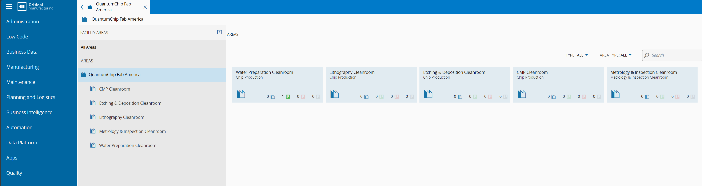

**Factory Explorer**: 

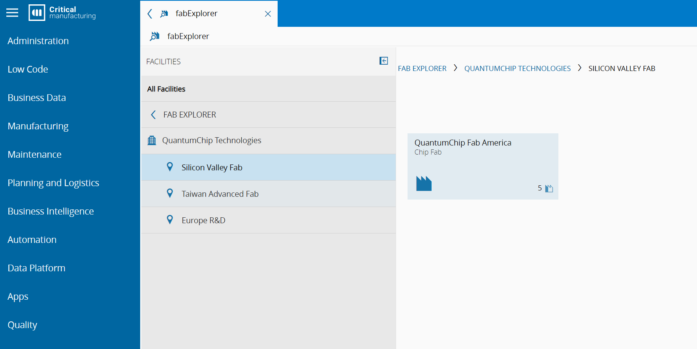

We can see how the MES fills in the model with information about the `Wafer Preparation Cleanroom`. It is part of an ISA95 structure with a facility, site and enterprise. 

It is a big comparative advantage of `Connect IoT` to be able to embbeb the data from sensors into a common standard.

---

## Connect IoT Structure

`Connect IoT` requires information about what protocols to be used. We will create one for `MQTT` and one for the `REST Server`. 


**Info:** Automation Protocols are the meta definitions, all Automation Driver Definitions will inherit the definition of the protocol, even though the controller may override particular parameters. This is helpful for parameters that change dynamically. Normally, most parameters have default values, we define those in the Automation Protocol.


---

### Create an Automation Protocol MQTT and Rest Server

For now, we will create them with the default settings.

`MQTT` **Automation Protocol**:


`REST Server` **Automation Protocol**:

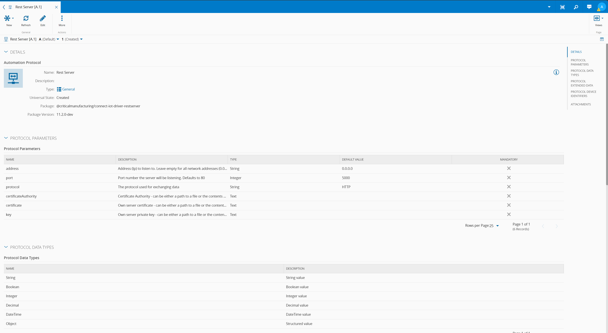

Notice that their settings are completely different. This is normal as each transport protocol has its own specificieties. In `Connect IoT`, when creating a driver you can specify all the settings that are particular to your driver.

---

### Create an Automation Driver Definition MQTT

The `Automation Driver Definition` will be where we map the relevant fields of the specification. Here is where we will configure all the events that we want to listen or commands that we want to execute.

The tutorial has a very simple example of of collecting temperatures and humidities. In this example, all topics have three levels i.e *waferprep/WPF-Temperature/WPF-Temp1* or *waferprep/WPF-Humidity/WPF-Humidity1* the second level *WPF-Temperature* or *WPF-Humidity* is what will inform the system if this value is for temperature or humidity.


**Info:** In a production setting is very common that the mapping of the system does not have a direct correlation with the MES. Here is where `Connect IoT` can serve as middleware to map everything into a common standard.


The `MQTT` driver in `Connect IoT` supports wildcards:
- '#' - can be used as a wildcard for all remaining levels of hierarchy. This means that it must be the final character in a subscription. For example: sensors/#
- '+' - can be used as a wildcard for a single level of hierarchy. For example: sensors/+/temperature/+

I will set the `Topic Name` as *waferprep/WPF-Temperature/#* for temperature and *waferprep/WPF-Humidity/#* for humidity. I could choose different variations like *+/WPF-Humidity/#*, but let's keep it simple and readable.

In our example, we have to create two properties:


An event and the link between properties and events:


We are informing the system that whenever there is a new publish for the topic *waferprep/WPF-Temperature/#* we want an event to be generated. 

We could have multiple properties in the same event and have the event only be triggered whenever the trigger tag changed. If for example there was a node structure like:

```
- waferprep
  - WPF-Temperature
    - WPF-Temp1
      - Value
      - Manufacturer
      - ID
      ...
```

We could create an event that would keep all the relevant information, and would only trigger when the `Value` changed.

---

### Create an Automation Driver Definition REST Server

The REST Server will host REST APIs that can be invoked by REST Clients. The driver definition is where we can define what are the available APIs of our REST Server.

For this example the REST API will have to support receiving a JSON Payload:

```json
POST /api/waferprep/air-quality HTTP/1.1
Host: example.com
Content-Type: application/json
Authorization: Bearer YOUR_API_TOKEN

{
  "device_id": "AQM-12345",
  "location": {
    "latitude": 37.7749,
    "longitude": -122.4194
  },
  "timestamp": "2025-03-07T12:00:00Z",
  "readings": {
    "pm2_5": 35.2,   // Fine particulate matter (µg/m³)
    "pm10": 45.7,    // Coarse particulate matter (µg/m³)
    "co2": 410.2,    // Carbon dioxide (ppm)
    "voc": 0.7       // Volatile organic compounds (ppm)
  },
  "status": "ok"
}
```

Let's see how we can map this.

The REST Server supports all REST verbs i.e GET, Post, etc. For our api call we can see that it's a `POST`, for the api `api/waferprep/air-quality`. Then it has a two objects, the `location` and the `readings`. In `Connect IoT`, you can choose to receive the full payload and handle it in the controller or use the driver to do the parsing for you.

In our example, we have to create seven properties to match the fields of our JSON payload. The REST Server supports specifying a `Property Name`, in the case of the `Request Component Type` `Body`, it is a dot separated path to the JSON value:

In the case of the `device_id` it is a first order value:

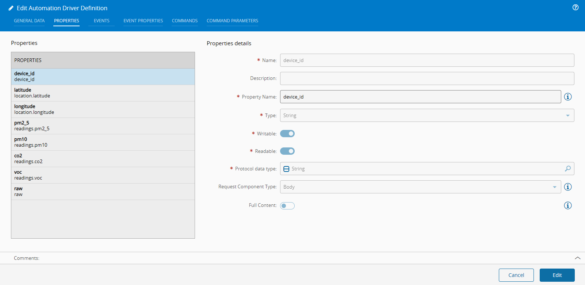

In latitude it is under location:


In our event we will define our api routing and verb. We can also define if the reply is to be given manually or automatic. If it's set as automatic it means that the driver will reply, even before sending to the controller. This is helpful for use cases of fire and forget sensor data, like our use case.

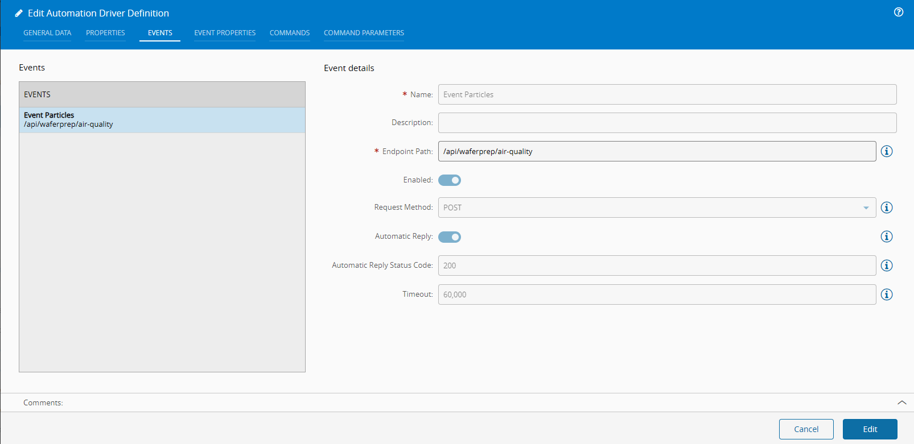

We can now build our event:

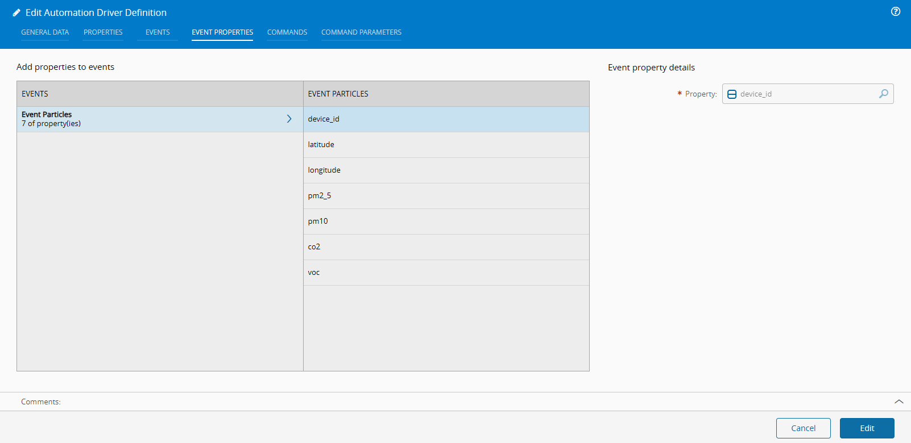

Notice that by separating properties from events it means you can reuse properties in different events. This is helpful if you have api calls that have similar structures, for example metadata headers, you can just reuse the properties.

---

### Create an Automation Controller

Creating our controller we will specify that it has our two drivers:

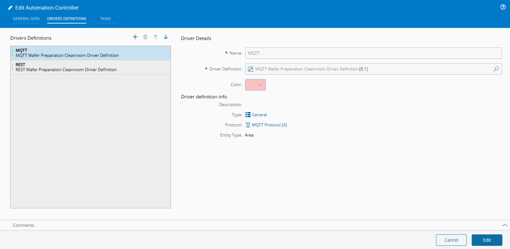

For this use case I also explored creating some custom tasks which I will explain in a different blog post:

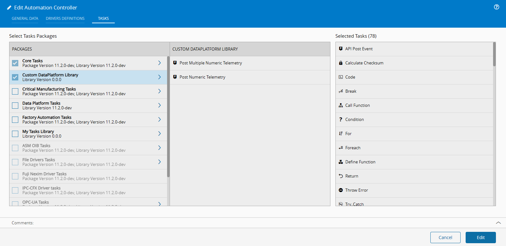

Notice how I have a `Custom DataPlatform Library`, this is my customization package. It has two tasks to simplify the post to dataplatform and to automatically resolve the `ISA95`.

### Setup

In our setup page the template will automatically generate the two driver quickstart. I will just add a new element to store the entity instance associated with this controller. This way we can reuse it for resolving the ISA95.

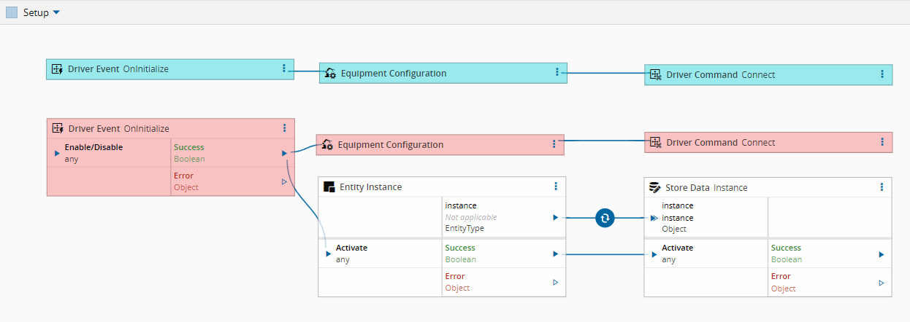


**Info:** In this example, I am statically defining address and port and other settings for convenience. In a normal productive use case these would be dynamically resolved, from an entity attribute, a table or some other way.


### Collect Sensor Data

Let's take a look at the sensor data. I will use control flow for these integrations. 

Control flow is still in preview and is a different way to design iot workflows. Data flow, the previous designer, is still maintained and has a lot of use cases where it really shines but for others it has its downsides. Control flow shines in being very fast and responsive it offers a deterministic and sequential flow that allows for the system to be more performant, it loses a bit of data visibility. Data flow is very good in showing how data passes between tasks. So, both have their use cases, in this example where I really want crank up the amount of data I am collecting I will use Control flow.

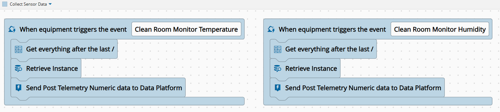

We have two events, they are very similar let's look at temperature. 

In Control flow, everything starts with an event (by event I mean an event as something that is listening for some action, can be an equipment event, a timer etc). These types of task are presented in control flow as pronged tasks, all tasks enabled in Control flow must reside inside one of these initiator tasks and there is only one per execution flow.

In our flow we have the `Clean Room Monitor Temperature` event as the wrapper for our Control flow execution. 

We will extract the sensor name from the topic i.e *waferprep/WPF-Temperature/WPF-Temp1* would be `WPF-Temp1`. So we will apply a regular expression task to retrieve all that is after the last `/`.

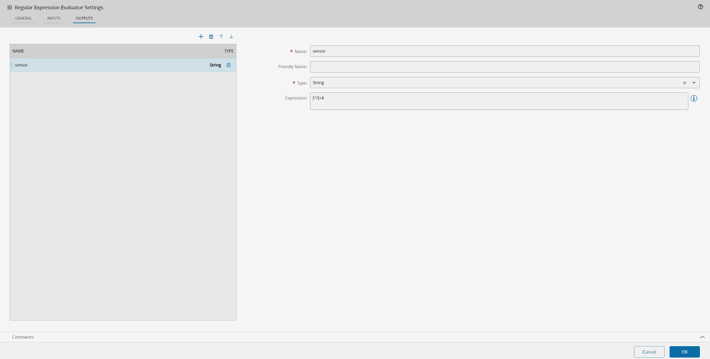

Notice that we will create a new output of name `sensor` which will be an expression `[^/]+$` applied to the input of the regular expression. The `topic` is specific to `MQTT` and therefore not a default part of the event we must retrieve it from the event.

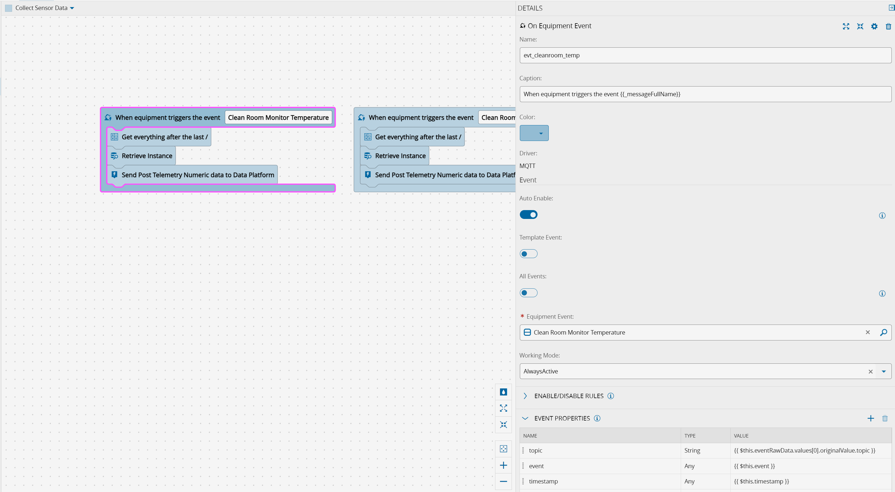

I added a new output called topic. In Control flow we can add outputs that are transformation of other values. In this case I extracted the tutorial from the raw event `{{ $this.eventRawData.values[0].originalValue.topic }}`. In Control flow everything that is in between `{{ }}` is an expression and can acess contextual values using $ and name of context. If for example I wanted to see everything that existed in eventRawData I could add a log message task with an expression

```
{{ stringify($evt_cleanroom_temp.eventRawData) }}
```

and this would log all acessible elements of the event.


**Info:** The names of all the tasks are automatically generated when dragged and dropped but can be changed to be more friendly.


In the regular expression task we can now add as an input the `topic` output of the `evt_cleanroom_temp` task, by adding an expression: 

```
{{ $evt_cleanroom_temp.topic }}
```

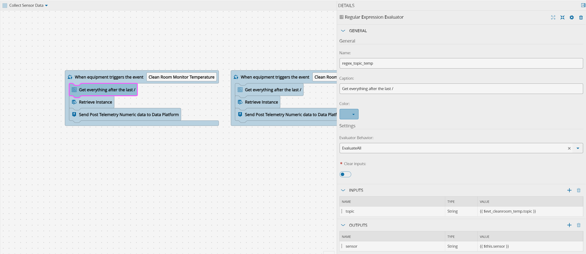

The Retrieve Instance is very simple and will retrieve the instance stored in the `Setup` page.

The `Send Post Telemetry Numeric data to Data Platform` is a simplified version of the defaut task `API Post Event`. The `API Post Event` is agnostic and can be used for any iot event definition. This makes it so its api is a bit cumbersome and expects complex data structures that would make my workflow more complex.

IoT Data Platform out of the box comes with two iot events for integrations, the PostTelemetry and the PostMetrology. PostMetrology is tied to material that is in process, where as PostTelemetry is targeting ad-hoc data, similar to what we have in our use case. That is why I created a trimmed down version of the `API Post Event` just for the PostTelemetry.

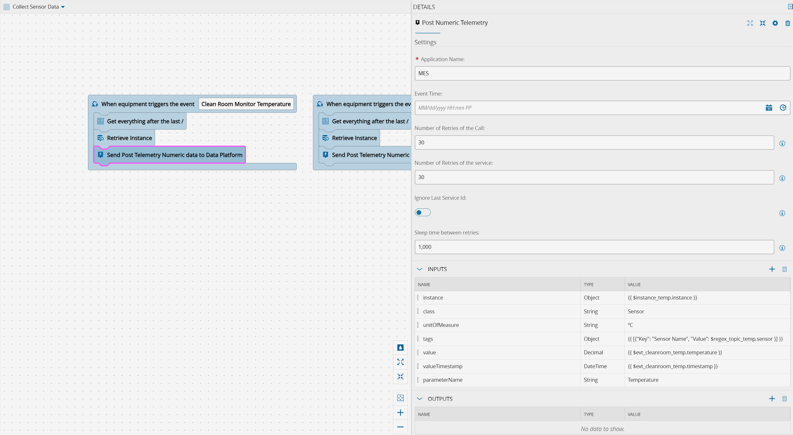

In the post event task we can define all the contextual information, some will be infered by the instance, but we can define the units, I am also saving the sensor name as a tag and the parameter name as Temperature.

### Collect Particle Data

This is very similar but dedicated to the REST request to post air monitoring data.

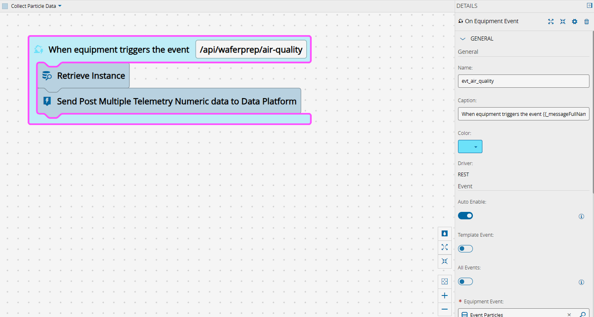

Now we no longer need the regular expression to parse the topic, but we will need a different task to post the `Post Multiple Numeric Telemetry`. In the other sensor a post matched one value, in this case we will have multiple datapoints each one for different value types.

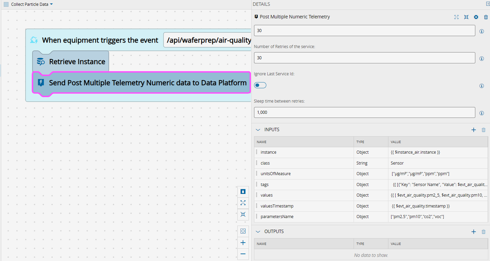

We will now specify that the values are not just one but an array of three: 

```
{{ [ $evt_air_quality.pm2_5, $evt_air_quality.pm10, $evt_air_quality.co2,$evt_air_quality.voc ] }}
```

---

## Seeing the Data

Let's see what we can do with this controller!!!

### Automation Manager

I connected the Controller to an Automation Manager and developed a test application to generate data.

Test application generating `MQTT` publishes and `REST Client` calls:

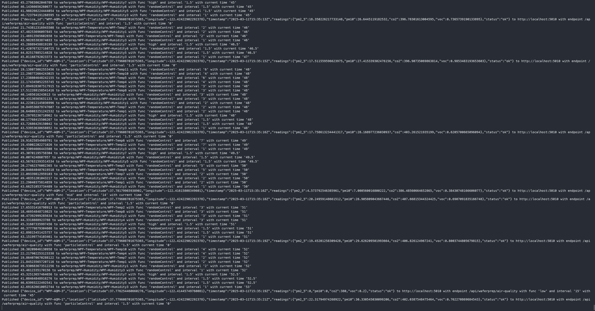

Manager Ingesting the Data:

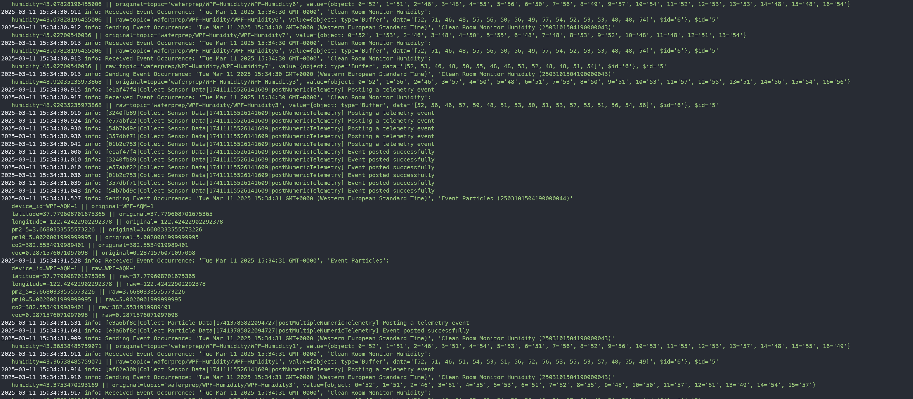

We are sending now alot of sensor information to `Connect IoT` that is ingesting it, adding context and posting it to data platform.

### Kafka

The data posted by the automation manager is stored in a kafka topic for raw messages,

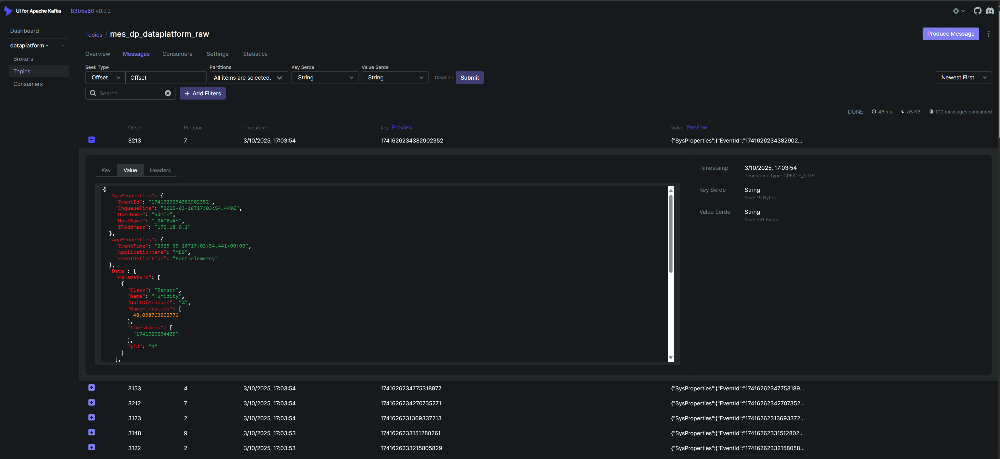

Example message:

```json
{
	"SysProperties": {
		"EventId": "1741626234382902352",
		"EnqueueTime": "2025-03-10T17:03:54.449Z",
		"UserName": "admin",
		"HostName": "_GATEWAY",
		"IPAddress": "172.18.0.1"
	},
	"AppProperties": {
		"EventTime": "2025-03-10T17:03:54.441+00:00",
		"ApplicationName": "MES",
		"EventDefinition": "PostTelemetry"
	},
	"Data": {
		"Parameters": [
			{
				"Class": "Sensor",
				"Name": "Humidity",
				"UnitOfMeasure": "%",
				"NumericValues": [
					48.098763062776
				],
				"Timestamps": [
					"1741626234405"
				]
			}
		],
		"Tags": [
			{
				"Key": "Sensor Name",
				"Value": "Back-Humidity5",
			}
		],
		"Resource": {},
		"Area": {
			"Name": "Backend Assembly Cleanroom"
		},
		"Facility": {
			"Name": "QuantumChip Fab Taiwan"
		},
		"Site": {
			"Name": "Taiwan Advanced Fab"
		},
		"Enterprise": {
			"Name": "QuantumChip Technologies"
		}
	}
}
```

We can see that the message has all the relevant ISA95 context, `Connect IoT` when handling the post for the message provided all the required context. With this contextual information the user can then perform actions on the data knowing that it's all properly contextualized.

The data will be processed from a raw messages kafka topic into the correct kafka topic, in this case for the post telemetry:

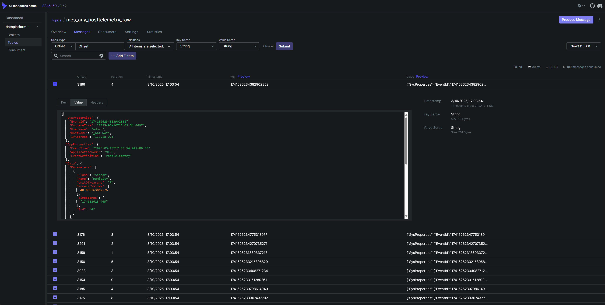

The data is then written to the database i.e Clikhouse. We can then in the MES generate new datasets over those tables and create new views on that data.

### Datasets

When an iot event definition is created a matching dataset is created, for example for post telemetry we already have a dataset:

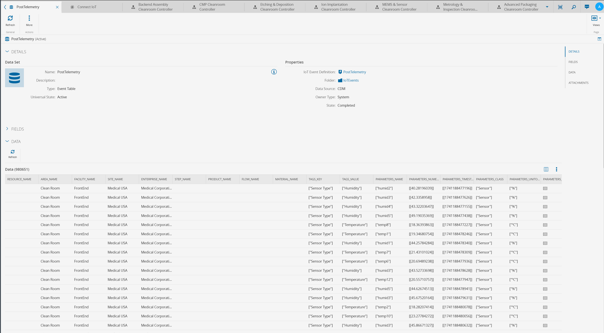

We can then define new datasets that are views over existing datasets. Let's for example create a new data set called the `Sensor Telemetry Dataset`.

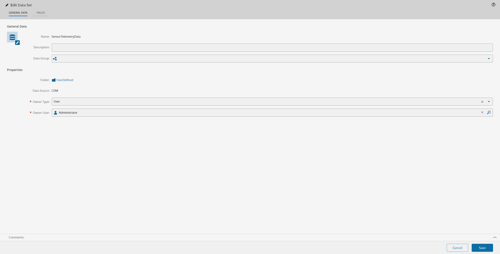

Which exists as a view on top of our `PostTelemetry` dataset, defined in this query.

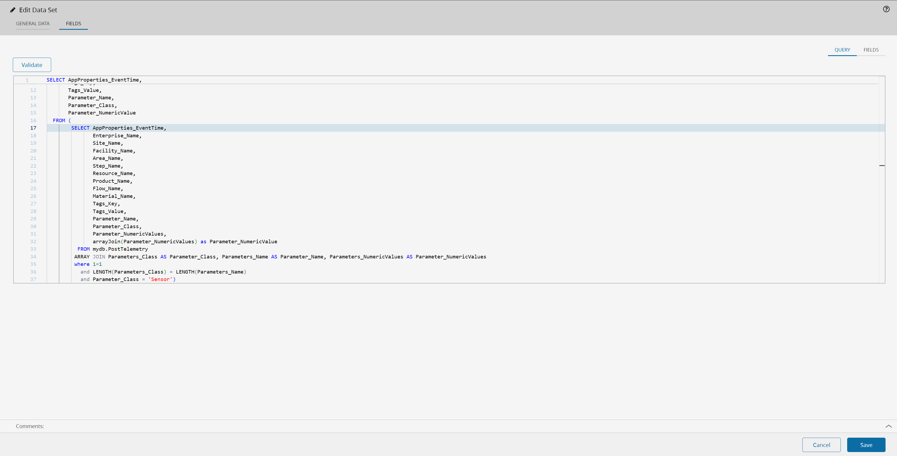

As the dataset for post telemetry already has data we can now see the data for our new dataset in the MES.

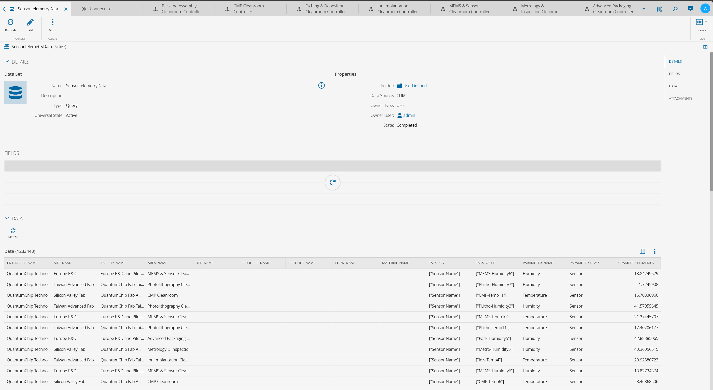

We can now use this data by quering the `Data Manager`. We can use for example Microsoft Excel or any other tool that is able to consume OData, or query the data by REST or gRPC.

### Grafana

For this example we can create a Grafana dashboard that consumes this Dataset.

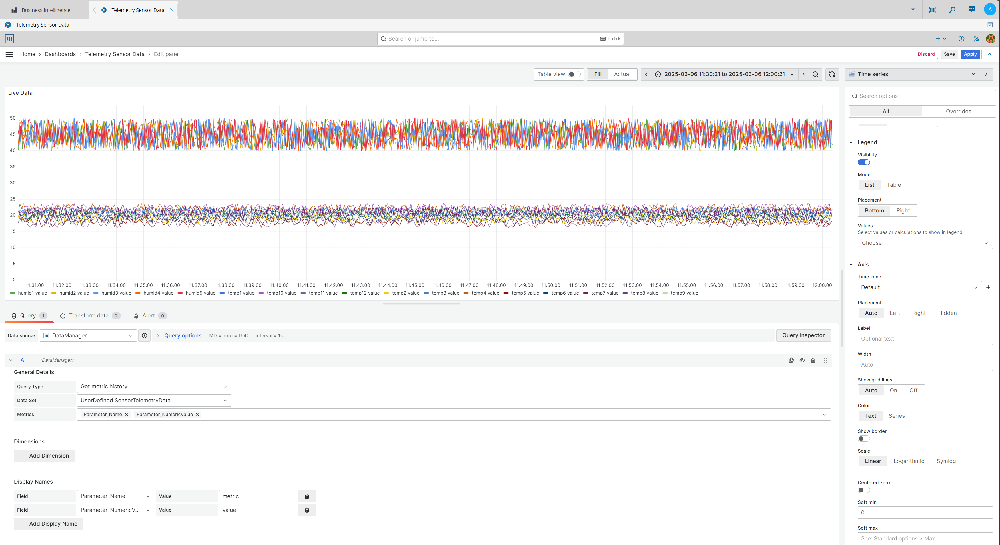

Notice we are retrieving this infomation from the `Data Manager` and by specifying the dataset `UserDefined.SensorTelemetryData`. This example is very simple and is trying to aggregate very disparate data, still we are able to select individual sensors and see what is happening at any given time.

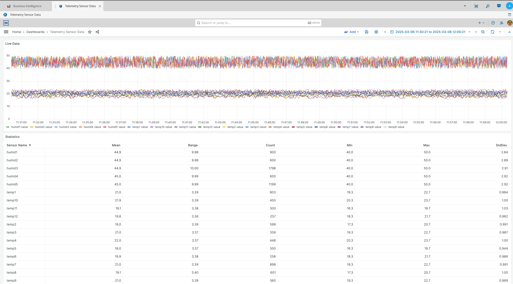

We can see by the metrics in the table below that we are really sending a lot of data points and our system is behaving nicely.

If we spend a little bit of effort we can leverage our sensor data to construct more advanced dashboards.

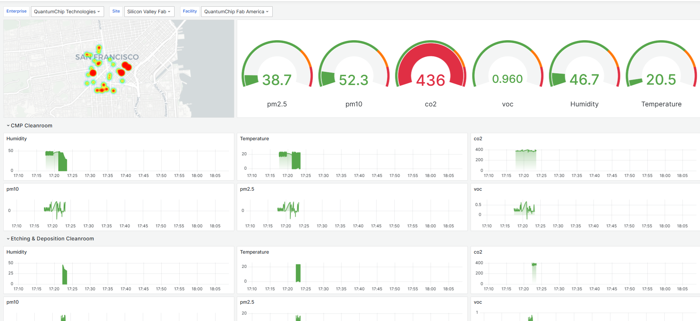

In this view we can filter by the ISA95, for example Enterprise *QuantumChip Technologies*, Site *Silicon Valley Fab*, Facility *QuantumChip Fab America* and we will see a dashboard with all the sensor data for each area. The areas are collapsable and show the live monitoring sensor feed. Also we can see the agregate consolidated as a gauge chart. We also have a geographical position of our sensors in the map area. Remember that in our example, the air quality monitoring sensors also posted their location coordinates, so we can leverage those to feed the map.

When you have a standardized and contextualized dataset all of these charts become possible.

## Summary

The goal of this post was just to showcase a very simple example of obtaining and handling data. Further transformations can be done on the data to create more views, now it's up to the user to now what he is looking for and traverse the data in search of information.

Thank you for reading !!!