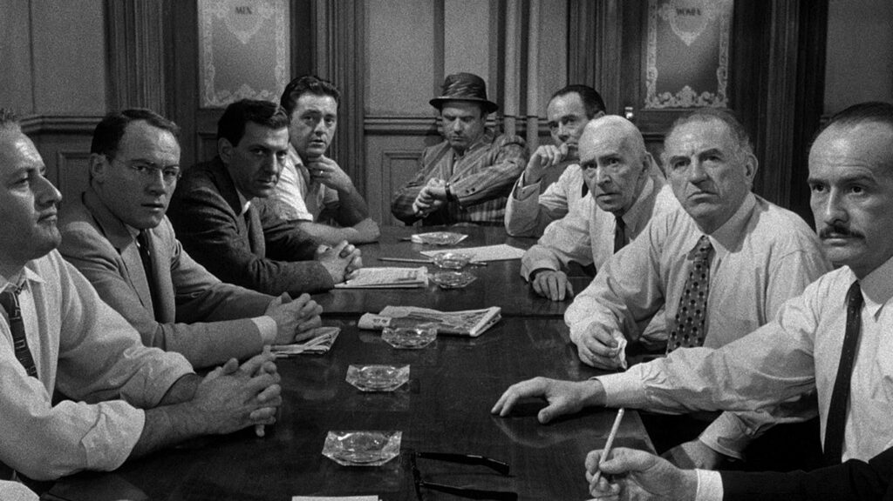
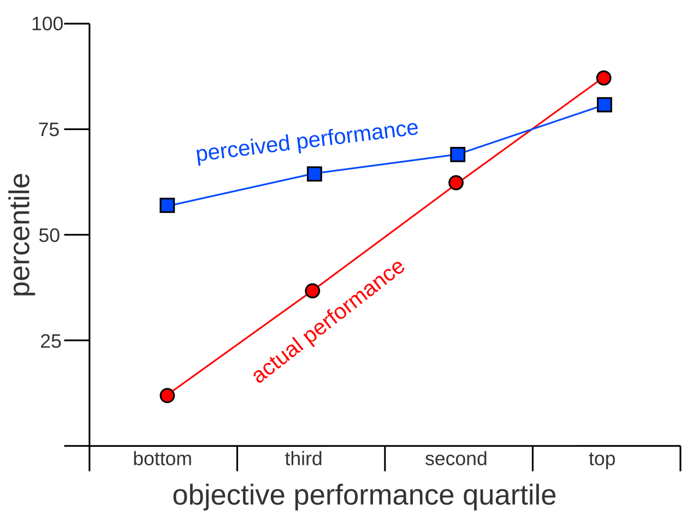

`Something is better than nothing.`

This is a very profound notion and one that is intrinsic to the whole concept of an engineer. He is someone that wishes to change what is to what could be in a very practical and flawed sense.

## Motivation

This week I had an architecture meeting. These meetings serve to help people in the organization that have complex requirements and need a third-party opinion. In this group we leverage the experience of some members to provide feedback and challenge requirements. These can be highly technical topics or can be understanding a bit more if the requirements make sense. They are also good ways to engage with the overall community and understand where people feel less confident.

In this particular meeting, I could only participate the first 15 minutes and then had to leave to another meeting. Yes, the modern day bliss of endless meetings. To me in those first 15 minutes I was completely relieved, the requirement was simple and straightforward, probably the simplest anyone had ever submitted to this group.

Jump to one hour after, I see the colleague that submitted the issue and apologize to him for having to leave the meeting early and asked him how the rest of the meeting went. What I saw was mind boggling. He looked at me with what could only be described as terror. His first sentence was simple and clear - "I don't know if I am going to be able to do it".

I was left in complete surprise and promptly asked him if the requirements were the one's that I thought. He replied they were exactly the one's I said. To which I followed with - "But that is just doing x and y. That's two days tops if you have no experience and if you use the first day playing guitar (a hobby of this colleague)". 

What went next was what prompted this blog post. He started saying things that I can only qualify as a cross between raving techno babble and demon speak. From concurrency problems, to parallelization strategies to scaling. A demented rant, not generated by his own mind of course, but by someone on the architecture forum, that instilled in him not the fear of God but something also quite terrible, the fear of coding.

He was injected with a terrible disease. All the possible use cases where something went wrong, of the roads wrongly taken, the bottomless pits an apocalypse of coding. Like a dooms day prophet this person in the architecture group, which is not doubt a very capable and intelligent developer, shot so many concepts, abstractions and possibilities of problems that it ended in what I can only describe as a Human Stack Overflow. It's pernicious and devilish as everything he said was true, every concept, every possibility, was valid and possible. It was a whole litany of truisms. 

Did it matter an once for the actual problem? No, it sure didn't.

I spent the next half hour in desperation and unbelief trying to deconstruct all of this and explaining to my colleague that a method call doesn't always end in a nuclear plant meltdown. I felt he left unconvinced, I hope he didn't give up software development and take on geese farming, but I am not convinced he won't.

This is a problem that I see a lot in very senior people and in software development generally. Sometimes we forget that we are engineers. We are here to perform the impossible. The impossible in the sense, of things that are not naturally occurring, until with our will we wished them into being. Therefore, how can we expect our will to be perfect. No engineer has ever built the perfect system, but should the infeasibility of perfection stop us from our goal of creation?

The answer is simple, let's be practical! Let's not let future issues and the inevitability of mistakes, stop us from the wonder and let's face it, the fun of creation.

## Hearing you in my head

I know what you are thinking. He is saying vibe code all the way, just code away without any regards for performance or testing. After all, what the colleague said was all completely valid, they were true warnings.

My argument is a very hard one. 

I am defending something that is like an appeal to common sense, proper measure, a middle way. 

Should your code be performant? That depends, what is the effort and ROI (return on investment) of making your code more performant. For some applications, performance is critical all edge cases are important, but let's face it those are rare. Even in those types of applications, there are parts that have those requirements and there are other parts where it doesn't really matter.

Is it interesting to see the performance [difference between LINQ, for and foreach?](https://stackoverflow.com/questions/22851234/linq-vs-foreach-vs-for-performance-test-results) Yes. Is that more important than writing code that everyone can understand at a glance? Depends. That is why an engineer is not a typist in C# or JS, he is someone that is able to understand a system and optimize what needs to be optimized and make trade offs. 

If you aim for no trade offs you will either be stuck in endless development or you will be so paralyzed by the immenseness of the labour ahead that you don't even start.

## Dunning–Kruger effect

The Dunning–Kruger effect is a very interesting cognitive bias where it basically states that the less knowledge you have about a topic, the more you tend to overestimate your ability in that topic. Numerous bad decisions have been made due to this and most software development methodologies try to deploy counter measures to this effect. This is always a hot topic when we are paternalistic regarding our more junior colleagues folly.

In a sense, the mountain is high and the climb is hard, it is also harder than you would expect in the base of the mountain, but should you stop climbing?

Sometimes I wonder if that naivety and folly of misjudging is also what helps us take risk and surpass ourselves. I fear that the end of the dunning-kruger curve may sometimes not be a hardened and seasoned old man, joyful to teach and spread the good news, the joy of reaching the summit, but is a ragged and disillusioned, grinch like cynic who raves about the lunacy of climbing. 

## Final Thoughts

Solving engineering problems is fun. Most problems are not complex, but they are a complex problem with a multitude of simple problems. Tackle the simple problems to start building to the complex problems.

Don't be paralyzed by the possibility of failure. You will fail. Learn to fail gracefully. Feature toggles, testing, documentation, assume you will fail and create the strategies to react to a failure.

Be joys and wondrous for working in building things that weren't there until you willed them into being and remember something is always better than nothing.